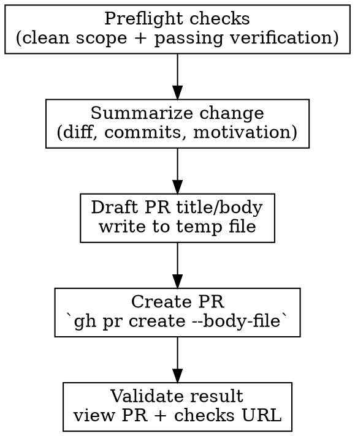

# Creating PR

Open pull requests consistently and safely.

**Core principle:** verify first, then open a PR with clear reviewer context.

## Preconditions

Before creating a PR:
1. Run tests and linters now — fresh output, not memory. If they don't pass, fix first.
2. Branch only contains in-scope changes.

## Workflow



## 1) Preflight checks

```bash
git status --short
BASE_SHA=$(git merge-base HEAD origin/main)
git diff --stat "$BASE_SHA"...HEAD
git log --oneline "$BASE_SHA"..HEAD
```

If unrelated files are present, split them out before continuing.

## 2) Build reviewer context

Capture what changed and why:
- Problem / user impact
- Approach taken
- Risks and mitigations
- Verification evidence (tests, lint, manual checks)

## 3) Draft PR title and body

Title guidance:
- Use a clear semantic prefix when applicable (`feat:`, `fix:`, `refactor:`, etc.)
- Describe user-visible outcome, not implementation trivia

Body template:

```md
## Summary
-

## Problem
-

## Solution
-

## Verification
- [ ] <command and result>

## Risks / Rollout
-

## Follow-ups
-
```

**Safety rule:** never inline PR body with `--body` because shell metacharacters can be evaluated. Always use `--body-file`.

```bash
cat > /tmp/pr-body.md << 'EOF'
## Summary
- ...
EOF
```

## 4) Create PR

```bash
gh pr create --title "<title>" --body-file /tmp/pr-body.md
```

Common options:

```bash
gh pr create \
  --title "<title>" \
  --body-file /tmp/pr-body.md \
  --base main \
  --draft
```

## 5) Validate PR and share link

```bash
gh pr view --json url,number,title,state --jq '{number, title, state, url}'
gh pr checks --watch
```

Report back with:
- PR URL
- scope summary
- verification commands executed
- open risks / follow-ups
- documentation updated (if behavior changed)

## Common mistakes

- Opening PR before running verification
- Including planning/design docs not in scope
- Vague title/body with no reviewer context
- Using `--body` inline instead of `--body-file`
- Claiming "ready" without confirming checks state
